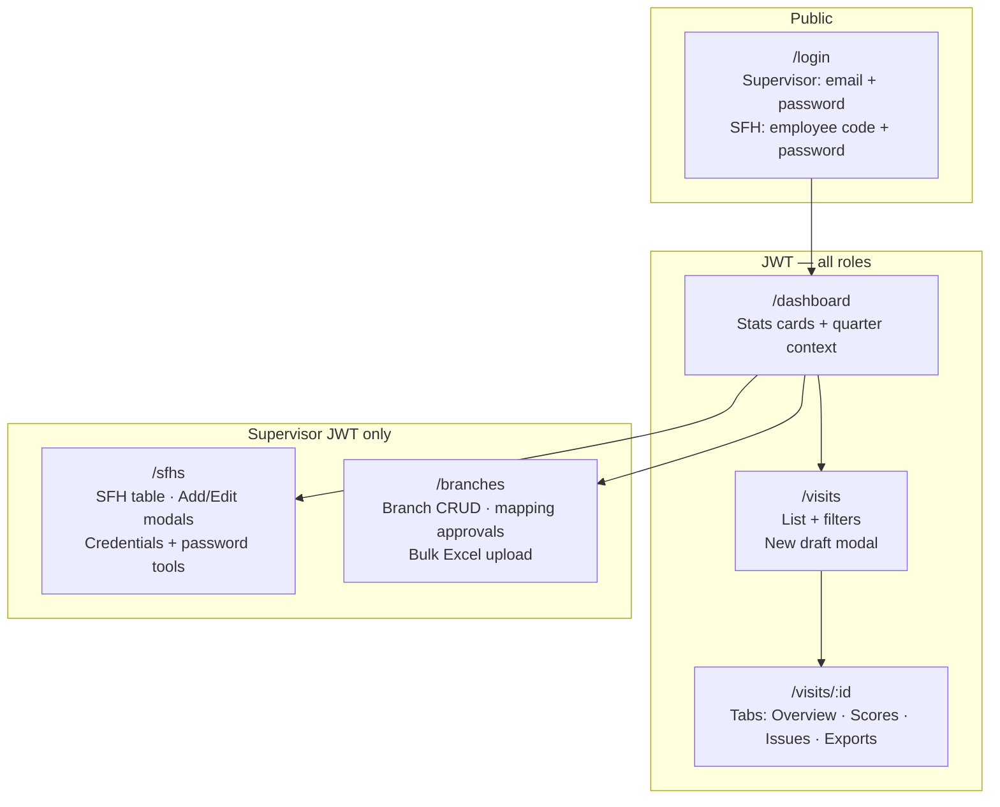
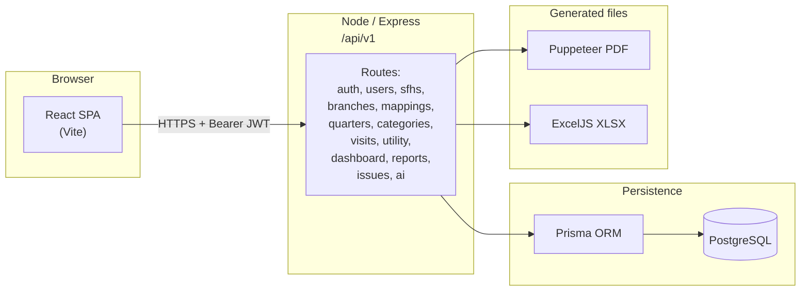

# Branch Visit Tracker — Implementation Reference

A full-stack facility management tool that lets **State Facility Heads (SFH)** record quarterly branch visits and assessment scores, while **Supervisors** monitor progress, approve branch assignments, and generate reports across the whole organisation.

---

## Tech Stack

| Layer | Technology |
|-------|-----------|
| Frontend | React 19, Vite 8, TypeScript, Ant Design 6, React Router 7 |
| Backend | Node.js 24, Express 4, TypeScript, Prisma 6 |
| Database | PostgreSQL 16 |
| Auth | JWT (access: 15 min, refresh: 7 days), bcrypt; supervisors sign in with **email**, SFHs with **employee ID** + supervisor-managed passwords |
| Reports | Puppeteer (HTML → PDF); **ExcelJS** for styled XLSX (visit exports + supervisor reports). `xlsx` remains for branch bulk-upload parsing. |
| Validation | Zod |

**Dev URLs**
- Frontend: `http://localhost:5173`
- Backend API: `http://localhost:3001/api/v1`

### Recent updates (May 2026)

- **SFH Management (supervisor UI):** Employee code is required and is the SFH **login ID** (not email). **Generate** loads a random password from `GET /sfhs/generate-password`; the field is read-only and visible until save. `POST /sfhs` sends that password so it matches what the supervisor shares. **Edit** uses show/hide for login ID; **Show current password** reads an encrypted supervisor vault (same value as login; audited). Current password cannot be inferred from bcrypt alone—**Generate new password** calls `POST /sfhs/:id/regenerate-password`. SFHs can queue a reset from the login flow (`POST /auth/sfh/request-password-reset`); supervisors fulfill with `POST /sfhs/password-reset-requests/:requestId/fulfill` (see API table).
- **Exports:** Visit PDFs and org reports use a shared styled layout (document header/footer, section titles, tables). Excel workbooks use branded title rows, navy column headers, borders, zebra striping, and column widths via ExcelJS.
- **README:** API tables and supervisor docs updated for the above; SFH accounts are **not** created through `POST /users` (that route rejects `role=sfh`).

---

## Product map and wireframes

### Information architecture (routes and roles)

Authenticated users land in the **App layout** (top nav + content). SFH-only and supervisor-only areas are enforced in the React router and on the API.



### Application shell (conceptual UI wireframe)

Every authenticated page shares this frame (Ant Design `Layout`: sticky header, scrollable content).

```
┌─────────────────────────────────────────────────────────────────────────────┐
│  [icon] Branch Visit Tracker     Dashboard   Visits   [SFH] [Branches]    │
│  (dark header, horizontal menu — extra items only if role = supervisor)      │
├─────────────────────────────────────────────────────────────────────────────┤
│                                                                             │
│   ┌─ PageHeader: title + subtitle + primary actions (e.g. Add SFH)        │
│   └────────────────────────────────────────────────────────────────────     │
│                                                                             │
│   ┌─ Main region ───────────────────────────────────────────────────────    │
│   │  Cards / metrics row (optional)                                       │
│   │  ┌─────────────────────────────────────────────────────────────┐     │
│   │  │ Table, forms, tabs (visit detail), or modal dialogs           │     │
│   │  └─────────────────────────────────────────────────────────────┘     │
│   └────────────────────────────────────────────────────────────────────     │
│                                                                             │
└─────────────────────────────────────────────────────────────────────────────┘
```

### Visit detail page (conceptual wireframe)

```
┌─────────────────────────────────────────────────────────────────────────────┐
│  ← Back to visits        Branch · Quarter              [Draft|Submitted]    │
├─────────────────────────────────────────────────────────────────────────────┤
│  [ Overview ] [ Scores ] [ Issues ] [ Exports ]   ← Ant Tabs                 │
├─────────────────────────────────────────────────────────────────────────────┤
│  · Score summary card (when snapshot exists)                                │
│  · Tab-specific panels (form sections, grouped score tables, issues grid)   │
│  · Sticky save / submit actions where applicable                            │
└─────────────────────────────────────────────────────────────────────────────┘
```

### Backend architecture (API surface)

The HTTP server mounts a versioned JSON API. Business logic for PDFs, Excel, audits, and quarter bootstrap lives in `backend/src/services`.



---

## Running Locally (Windows — Portable PostgreSQL)

```powershell
# 1. Start PostgreSQL (portable install)
$pgBin  = "C:\Users\Divyam\AppData\Local\pgsql16\pgsql\bin"
$pgData = "C:\Users\Divyam\AppData\Local\pgsql16\data"
$pgLog  = "C:\Users\Divyam\AppData\Local\pgsql16\postgres.log"
& "$pgBin\pg_ctl.exe" -D $pgData -l $pgLog start

# 2. Regenerate Prisma client (if schema changed)
cd backend && npx prisma generate

# 2b. First-time seed: add SEED_SUPERVISOR_EMAIL and SEED_SUPERVISOR_PASSWORD to backend/.env (see .env.example), then:
#     cd backend && npm run db:seed

# 3. Backend  (terminal 1 — backend/)
npm run dev          # tsx watch src/app.ts → port 3001

# 4. Frontend  (terminal 2 — frontend/)
npm run dev          # vite → port 5173
```

**Seed credentials**

| Role | Sign-in | Password |
|------|----------|------------|
| Supervisor | `admin@company.com` (set via `SEED_SUPERVISOR_EMAIL` in `backend/.env`, then run seed) | Same as `SEED_SUPERVISOR_PASSWORD` after seed. |
| SFH | **Employee ID** from seed (e.g. `SFH-001` … `SFH-005`), not email | Printed once in the console when you run `npm run db:seed` in `backend/` (random each seed). A supervisor can set a new password from **SFH Management → Edit → Generate new password**, or fulfill a pending reset via the API (`POST /sfhs/password-reset-requests/:requestId/fulfill`). |

After `cd backend && npm run db:seed`, check the terminal for lines like `[seed] SFH … — login ID: … — one-time password: …`.

### Debug mode (pre-deploy)

- **Backend**: In `backend/.env`, set `API_DEBUG=true`, then `npm run dev`. You get `[api-debug]` lines for every request (method, URL, status, duration), Prisma **SQL query** logs on stdout, and JSON error bodies that include **`stack`** (and raw Zod **`issues`**) where applicable. Remove or set `API_DEBUG=false` before a public production deploy.
- **Frontend**: For a production-like bundle with **source maps**, from `frontend/` run `VITE_DEBUG=true npm run build` (see commented line in `.env.development`).

---

## Production deploy (Render + Vercel)

See **[DEPLOY.md](DEPLOY.md)** for GitHub → Render (API + PostgreSQL) + Vercel (frontend), environment variables, CORS/cookies, and smoke checks.

---

## Security & production deployment

- **Secrets**: Keep `DATABASE_URL`, JWT secrets, and `RESEND_API_KEY` only on the server or in a secrets manager. Use `backend/.env.example` as a template; never commit `.env`. Run `npm run security:scan-secrets --prefix backend` before releases.
- **HTTPS**: Set `ENFORCE_HTTPS=true` when the API is behind a TLS-terminating reverse proxy (`trust proxy` is enabled). `GET /health` stays usable over HTTP for internal probes.
- **Database**: Docker Compose does not publish Postgres `5432` by default—only containers on the Compose network can reach it. For managed databases, use private networking or firewall rules so the DB is not exposed to the internet.
- **Email verification**: After configuring outbound email (`RESEND_API_KEY`, `EMAIL_FROM`) and `APP_PUBLIC_URL`, you can set `REQUIRE_EMAIL_VERIFICATION=true`.
- **Logging**: The API writes JSON lines to stdout for authentication events, rate-limit hits, HTTPS blocks, and uncaught handler errors (`api_error`)—forward these logs for monitoring and alerts.

---

## Running via Docker

```bash
docker compose up --build
```

Backend: `http://localhost:3001/api/v1`
Frontend (nginx): `http://localhost:8080`

---

## Database Schema

### Enums

| Enum | Values |
|------|--------|
| `UserRole` | `supervisor`, `sfh`, `branch_staff` |
| `BranchType` | `vistaar`, `non_vistaar` |
| `ApprovalStatus` | `pending`, `approved`, `rejected` |
| `VisitType` | `physical`, `virtual` |
| `ScoreStatus` | `yes`, `no`, `not_applicable` |
| `IssueStatus` | `open`, `in_progress`, `resolved` |
| `ScoreBand` | `excellent`, `good`, `satisfactory`, `needs_improvement`, `critical` |
| `DgOwnership` | `rented`, `company_owned`, `na` |

---

### Table: `users`

| Column | Type | Notes |
|--------|------|-------|
| `id` | UUID PK | auto |
| `name` | VARCHAR(255) | |
| `email` | VARCHAR(255) UNIQUE | stored lowercase |
| `password_hash` | VARCHAR(255) | bcrypt cost 12 |
| `role` | UserRole | supervisor / sfh / branch_staff |
| `is_active` | BOOLEAN | default true; soft-deactivate only |
| `created_at` | TIMESTAMP | |
| `updated_at` | TIMESTAMP | auto |

Relations: one-to-one `state_facility_heads`, one-to-many `sfh_branch_mapping` (as approver), one-to-many `audit_logs`.

---

### Table: `audit_logs`

Immutable trail of supervisor actions that modify visit data.

| Column | Type | Notes |
|--------|------|-------|
| `id` | UUID PK | |
| `actor_id` | UUID FK → users | |
| `action` | VARCHAR(160) | e.g. `visit_date_unlock` |
| `entity_type` | VARCHAR(100) | e.g. `branch_visit` |
| `entity_id` | VARCHAR(100) nullable | |
| `metadata` | JSON nullable | arbitrary payload |
| `created_at` | TIMESTAMP | |

Index on `(entity_type, entity_id)`.

---

### Table: `state_facility_heads`

Profile extension for users with role `sfh`.

| Column | Type | Notes |
|--------|------|-------|
| `id` | UUID PK | |
| `user_id` | UUID UNIQUE FK → users | one-to-one |
| `employee_code` | VARCHAR(50) nullable | |
| `phone` | VARCHAR(20) nullable | |
| `state_region` | VARCHAR(100) nullable | required on creation |
| `created_at` | TIMESTAMP | |

Relations: one-to-many `sfh_branch_mapping`, one-to-many `branch_visits`.

---

### Table: `branches`

Master data for every physical branch.

| Column | Type | Notes |
|--------|------|-------|
| `id` | UUID PK | |
| `branch_code` | VARCHAR(20) UNIQUE | natural key used in all exports |
| `sap_code` | VARCHAR(20) nullable | |
| `branch_name` | VARCHAR(255) | |
| `location` | VARCHAR(255) nullable | |
| `city` | VARCHAR(100) nullable | |
| `state` | VARCHAR(100) nullable | |
| `zone` | VARCHAR(100) nullable | |
| `branch_type` | BranchType | `vistaar` / `non_vistaar` |
| `date_of_operationalization` | DATE nullable | |
| `carpet_area_sqft` | DECIMAL(10,2) nullable | |
| `boi_name` | VARCHAR(255) nullable | Branch Operations Incharge name |
| `branch_manager_name` | VARCHAR(255) nullable | |
| `branch_operation_incharge` | VARCHAR(255) nullable | |
| `premise_owner` | VARCHAR(255) nullable | |
| `staff_outsource` | INT default 0 | outsourced headcount |
| `staff_company_roll` | INT default 0 | on company payroll |
| `staff_hk_resources` | INT default 0 | housekeeping |
| `staff_talic_employees` | INT default 0 | |
| `workstations_linear` | INT default 0 | |
| `workstations_lshape` | INT default 0 | |
| `workstations_cubical` | INT default 0 | |
| `ups_capacity_kva` | DECIMAL(6,2) nullable | |
| `ups_backup_time_mins` | INT nullable | |
| `ac_tonnage` | DECIMAL(6,2) nullable | |
| `electricity_load_kw` | DECIMAL(6,2) nullable | |
| `rms_vendor_present` | BOOLEAN default false | |
| `rms_vendor_name` | VARCHAR(255) nullable | |
| `fire_extinguisher_count` | INT default 0 | |
| `dg_ownership` | DgOwnership default na | `rented` / `company_owned` / `na` |
| `dg_capacity_kva` | DECIMAL(6,2) nullable | |
| `is_active` | BOOLEAN default true | soft-delete |
| `created_at` / `updated_at` | TIMESTAMP | |

Relations: one-to-many `sfh_branch_mapping`, one-to-many `branch_visits`, one-to-many `utility_consumption`.

---

### Table: `sfh_branch_mapping`

Tracks which SFH is responsible for which branch, with a supervisor approval gate.

| Column | Type | Notes |
|--------|------|-------|
| `id` | UUID PK | |
| `sfh_id` | UUID FK → state_facility_heads | |
| `branch_id` | UUID FK → branches | |
| `approved_by` | UUID FK → users nullable | supervisor who approved/rejected |
| `approval_status` | ApprovalStatus default pending | |
| `approval_remarks` | TEXT nullable | |
| `effective_from` | DATE | set by supervisor on create |
| `effective_to` | DATE nullable | auto-set when a new mapping supersedes this one |
| `is_current` | BOOLEAN default false | exactly one current mapping per branch at a time |
| `created_at` | TIMESTAMP | |

Index on `(sfh_id, branch_id, is_current)`.

**Approval flow:** `pending → approved` (sets `is_current=true`, closes old mapping with `effective_to=now`) or `pending → rejected`. Only one pending mapping per branch allowed at a time.

---

### Table: `quarters`

Financial year quarters. Automatically bootstrapped ahead by the server on startup.

| Column | Type | Notes |
|--------|------|-------|
| `id` | UUID PK | |
| `financial_year` | INT | e.g. 2025 |
| `quarter_number` | INT | 1, 2, or 3 |
| `start_date` | DATE | |
| `end_date` | DATE | |
| `label` | VARCHAR(20) nullable | e.g. "Q1 FY25" |

Unique constraint: `(financial_year, quarter_number)`.

---

### Table: `assessment_categories`

Top-level groupings for the scoring rubric (e.g. "Cleanliness", "Safety", "Infrastructure").

| Column | Type | Notes |
|--------|------|-------|
| `id` | UUID PK | |
| `name` | VARCHAR(100) | |
| `display_order` | INT | sort order in UI and exports |
| `weight_percent` | DECIMAL(5,2) nullable | category weight in total score |
| `max_points` | INT nullable | |
| `version` | INT default 1 | for rubric versioning |
| `effective_from` | TIMESTAMP | |
| `is_active` | BOOLEAN | |

---

### Table: `assessment_subcategories`

Individual scoring criteria within a category.

| Column | Type | Notes |
|--------|------|-------|
| `id` | UUID PK | |
| `category_id` | UUID FK → assessment_categories | |
| `name` | TEXT | criterion label |
| `description` | TEXT nullable | |
| `max_score` | INT default 5 | |
| `weight_within_category` | DECIMAL(5,2) nullable | |
| `display_order` | INT | |
| `is_active` | BOOLEAN | |

Unique constraint: `(category_id, display_order)`.

---

### Table: `branch_visits`

One record per branch per quarter. Unique constraint: `(branch_id, quarter_id)`.

| Column | Type | Notes |
|--------|------|-------|
| `id` | UUID PK | |
| `branch_id` | UUID FK → branches | |
| `sfh_id` | UUID FK → state_facility_heads | |
| `quarter_id` | UUID FK → quarters | |
| `mapping_id` | UUID FK → sfh_branch_mapping nullable | mapping active at time of draft creation |
| `visit_date_actual` | DATE nullable | |
| `visit_date_locked_at` | TIMESTAMP nullable | set on first save; supervisor clears to allow correction |
| `previous_visit_date` | DATE nullable | |
| `previous_visit_score` | DECIMAL(5,2) nullable | |
| `visit_type` | VisitType | `physical` / `virtual` |
| `virtual_staff_contact_name` | VARCHAR(255) nullable | |
| `virtual_staff_contact_phone` | VARCHAR(20) nullable | |
| `reason_for_no_visit` | TEXT nullable | |
| `boi_name_snapshot` | VARCHAR(255) nullable | point-in-time capture of branch BOI at visit time |
| `location_head_snapshot` | VARCHAR(255) nullable | |
| `branch_ops_incharge_snapshot` | VARCHAR(255) nullable | |
| `staff_outsource_snapshot` | INT nullable | |
| `staff_company_snapshot` | INT nullable | |
| `staff_hk_resources_snapshot` | INT nullable | |
| `staff_talic_employees_snapshot` | INT nullable | |
| `workstations_linear_snapshot` | INT nullable | |
| `workstations_lshape_snapshot` | INT nullable | |
| `workstations_cubical_snapshot` | INT nullable | |
| `is_infra_upgrade` | BOOLEAN default false | |
| `landlord_issue` | BOOLEAN default false | |
| `landlord_issue_details` | TEXT nullable | |
| `incident_previous_visit` | BOOLEAN default false | |
| `incident_previous_visit_details` | TEXT nullable | |
| `audit_points_observed` | BOOLEAN default false | |
| `audit_points_details` | TEXT nullable | |
| `major_escalation` | BOOLEAN default false | |
| `escalation_details` | TEXT nullable | |
| `escalation_closure_date` | DATE nullable | |
| `is_submitted` | BOOLEAN default false | locks all editing |
| `submitted_at` | TIMESTAMP nullable | |
| `signed_sfh_at` | TIMESTAMP nullable | (reserved for future digital signature) |
| `signed_ops_incharge_at` | TIMESTAMP nullable | |
| `signed_location_head_at` | TIMESTAMP nullable | |
| `created_at` / `updated_at` | TIMESTAMP | |

---

### Table: `visit_scores`

One row per subcategory per visit, pre-seeded when the draft is created.

| Column | Type | Notes |
|--------|------|-------|
| `id` | UUID PK | |
| `visit_id` | UUID FK → branch_visits | |
| `subcategory_id` | UUID FK → assessment_subcategories | |
| `status` | ScoreStatus | `yes` / `no` / `not_applicable` |
| `score_given` | INT nullable | null when status = `not_applicable` |
| `max_score` | INT | copied from subcategory at draft creation |
| `observations` | TEXT nullable | |
| `rems_number` | VARCHAR(100) nullable | REMS system reference number |
| `remarks` | TEXT nullable | |

Unique constraint: `(visit_id, subcategory_id)`.

---

### Table: `visit_issues`

Issues raised during a visit, tracked to resolution.

| Column | Type | Notes |
|--------|------|-------|
| `id` | UUID PK | |
| `visit_id` | UUID FK → branch_visits | |
| `category_id` | UUID FK → assessment_categories | |
| `issue_description` | TEXT | |
| `scheduled_closure_date` | DATE nullable | |
| `issue_status` | IssueStatus default open | `open` / `in_progress` / `resolved` |
| `resolution_notes` | TEXT nullable | |
| `created_at` | TIMESTAMP | |
| `resolved_at` | TIMESTAMP nullable | auto-set when status → `resolved` |

---

### Table: `score_snapshots`

Computed score summary, written after every score save and on submission. One-to-one with a visit.

| Column | Type | Notes |
|--------|------|-------|
| `id` | UUID PK | |
| `visit_id` | UUID UNIQUE FK → branch_visits | |
| `total_points_earned` | INT | sum of all `score_given` (N/A rows contribute 0) |
| `total_max_points` | INT | sum of `max_score` for non-N/A rows only |
| `score_percentage` | DECIMAL(5,2) | `earned / max * 100` |
| `score_band` | ScoreBand | derived from percentage thresholds |
| `category_breakdown` | JSON | per-category `{earned, max}` map |
| `calculated_at` | TIMESTAMP | |

---

### Table: `utility_consumption`

Quarterly utility and expense data per branch (upserted on write).

| Column | Type | Notes |
|--------|------|-------|
| `id` | UUID PK | |
| `branch_id` | UUID FK → branches | |
| `financial_year` | INT | |
| `quarter_number` | INT | 1–3 |
| `electricity_bill_amount` | DECIMAL(12,2) nullable | |
| `units_consumed` | DECIMAL(10,2) nullable | |
| `ot_expenses` | DECIMAL(12,2) nullable | overtime expenses |
| `action_points_expenses` | TEXT nullable | free-text breakdown |
| `remarks` | TEXT nullable | |

Unique constraint: `(branch_id, financial_year, quarter_number)`.

---

## REST API Reference

All routes are under `/api/v1`. JWT Bearer token required except: `POST /auth/login`, `POST /auth/refresh`, and `POST /auth/sfh/request-password-reset`.

### Auth

| Method | Path | Access | Description |
|--------|------|--------|-------------|
| POST | `/auth/login` | public | Returns `accessToken`, `refreshToken`, `user` object |
| POST | `/auth/sfh/request-password-reset` | public (rate-limited) | Body `{ employeeId }`; always returns `{ ok: true }` to avoid account enumeration |
| POST | `/auth/refresh` | public | Rotates both tokens |
| POST | `/auth/logout` | any | Stateless — client drops tokens |
| GET | `/auth/me` | any | Returns current user profile |

### Users *(supervisor only)*

| Method | Path | Description |
|--------|------|-------------|
| GET | `/users` | List all users |
| POST | `/users` | Create **supervisor** or **branch_staff** user (`email` + `password` + `role`). **`role=sfh` is rejected** — create SFHs only via `POST /sfhs` (employee ID + supervisor-generated password). |
| PATCH | `/users/:id` | Update name, `isActive`, or password |
| DELETE | `/users/:id` | Soft-deactivate (`isActive=false`); cannot self-deactivate |

### SFHs *(supervisor only)*

| Method | Path | Description |
|--------|------|-------------|
| GET | `/sfhs` | List SFHs with assigned branch counts |
| GET | `/sfhs/generate-password` | Random password suggestion for the supervisor UI (not stored) |
| GET | `/sfhs/password-reset-requests` | Pending SFH password-reset queue |
| POST | `/sfhs/password-reset-requests/:requestId/fulfill` | Set new random password for that SFH; mark request fulfilled; returns `{ temporaryPassword }` |
| POST | `/sfhs` | Create SFH atomically; JSON: `name`, `employeeId`, `stateRegion`, `password` (min 8), optional `phone` |
| POST | `/sfhs/:id/regenerate-password` | Supervisor sets a new random password; returns `{ temporaryPassword }`; updates supervisor-visible vault |
| GET | `/sfhs/:id/supervisor-password` | Returns `{ password }` (decrypted from DB vault). **Audited.** Missing vault → 404 until create/regenerate/reset fulfill populates it. Encryption key is derived from `JWT_SECRET` — rotating that secret breaks decryption until passwords are regenerated |
| PATCH | `/sfhs/:id` | Update `employeeId` (maps to employee code / login), `phone`, `stateRegion`, `name`, `isActive` |

### Branches

| Method | Path | Access | Description |
|--------|------|--------|-------------|
| GET | `/branches?q=` | any | Search by name/code/city/location; SFH sees only assigned |
| GET | `/branches/:id` | any | Single branch; SFH scoped to assigned |
| POST | `/branches` | supervisor | Create branch |
| PATCH | `/branches/:id` | supervisor | Update any field except `branchCode` |
| DELETE | `/branches/:id` | supervisor | Soft-delete (`isActive=false`) |
| POST | `/branches/bulk-upload` | supervisor | Excel upload; upserts by `branchCode`; returns `{inserted, updated, errors[]}` |

### SFH–Branch Mappings

| Method | Path | Access | Description |
|--------|------|--------|-------------|
| GET | `/mappings?status=` | any | Supervisor sees all; SFH sees own |
| GET | `/mappings/current` | supervisor | All live approved mappings |
| POST | `/mappings` | supervisor | Create pending mapping (409 if branch already has pending) |
| PATCH | `/mappings/:id/approve` | supervisor | Approve; atomically closes prior current mapping |
| PATCH | `/mappings/:id/reject` | supervisor | Reject pending mapping |

### Quarters

| Method | Path | Access | Description |
|--------|------|--------|-------------|
| GET | `/quarters` | any | All quarters; server auto-bootstraps on startup |

### Assessment Categories

| Method | Path | Access | Description |
|--------|------|--------|-------------|
| GET | `/categories` | any | All active categories with subcategories |

### Visits

| Method | Path | Access | Description |
|--------|------|--------|-------------|
| GET | `/visits` | any | Supervisor sees all; SFH sees own. Filters: `?status=draft\|submitted&quarter_id=&sfh_id=&score_band=` |
| POST | `/visits` | SFH | Create draft; branch must be assigned; one per branch per quarter |
| GET | `/visits/:id` | any | Full visit with scores, issues, snapshot; SFH scoped to own |
| PATCH | `/visits/:id` | SFH (draft only) | Update overview fields; visit date locks after first save |
| GET | `/visits/:id/scores` | any | Score rows ordered by category → subcategory |
| PUT | `/visits/:id/scores` | SFH (draft only) | Bulk-replace all scores; triggers snapshot recalculation |
| GET | `/visits/:id/issues` | any | List issues |
| POST | `/visits/:id/issues` | SFH (draft only) | Add issue |
| PATCH | `/visits/:id/issues/:issueId` | SFH (draft only) | Update status, closure date, resolution notes |
| DELETE | `/visits/:id/issues/:issueId` | SFH (draft only) | Delete issue |
| POST | `/visits/:id/submit` | SFH (draft only) | Final submission; validates all scores complete; locks editing |
| POST | `/visits/:id/unlock-date` | supervisor | Clears visit date lock; writes audit log |
| GET | `/visits/:id/pdf` | any | Download Puppeteer PDF (styled report: header/footer, sections, tables) |
| GET | `/visits/:id/excel` | any | Download XLSX (ExcelJS: banner, styled headers, zebra rows, sheets for summary/scores/utility/issues) |

### Utility Consumption

| Method | Path | Access | Description |
|--------|------|--------|-------------|
| GET | `/utility?branch_id=&financial_year=` | any | SFH scoped to assigned; supervisor sees all |
| POST | `/utility` | any | Upsert by `(branch_id, financial_year, quarter_number)` |
| PATCH | `/utility/:id` | any | Update amounts; SFH must own branch |

### Dashboard

| Method | Path | Access | Description |
|--------|------|--------|-------------|
| GET | `/dashboard/sfh` | SFH | Own current-quarter stats + Q1/Q2/Q3 breakdown |
| GET | `/dashboard/sfh/:sfhId` | supervisor | Same view for a specific SFH |
| GET | `/dashboard/supervisor` | supervisor | All SFH rows + org completion % |

### Reports

All accept `?format=pdf` (default) or `?format=excel`. SFH auto-scoped to own; supervisor can pass `?sfh_id=`. Excel outputs use **ExcelJS** styling (title banner, navy header row, borders, alternating row fills). PDFs use shared HTML/CSS (document chrome and sectioned tables).

| Method | Path | Description |
|--------|------|-------------|
| GET | `/reports/visited-branches?quarter_id=` | Submitted visits for a quarter |
| GET | `/reports/pending-branches?quarter_id=` | Mapped branches not yet visited; shows days remaining in quarter |
| GET | `/reports/issues-summary` | Issues with filters `?quarter_id=&status=&category=` |
| GET | `/reports/yearly-summary?financial_year=` | All quarters; Excel has one sheet per quarter |

### Issues Export *(SFH only)*

| Method | Path | Description |
|--------|------|-------------|
| GET | `/issues/export` | Download own open/in-progress issues as styled Excel; filter `?status=&category=` |

---

## SFH Profile — Full Functionality

The SFH role represents a State Facility Head responsible for visiting a set of branches each quarter.

### Access Control
- Sees only branches assigned via an **approved** `sfh_branch_mapping` (`is_current=true`, `approval_status=approved`).
- Can only read/edit visits where `sfh_id` matches their own SFH record.
- Cannot access any supervisor-only routes (user management, SFH management, mapping approval, org-wide reports).

### Dashboard
- **Current quarter**: label, financial year, start and end dates.
- **Own SFH stat row**: total mapped branches, visited (submitted), pending, completion %, open issues, resolved issues, average score % across submitted visits this quarter.
- **Quarterly breakdown**: Q1 / Q2 / Q3 visited vs. pending counts for the current financial year.

### Visits List
- Tabbed filter: All / Drafts / Submitted.
- Table columns: Branch Code · Name, Quarter, SFH (self), Visit Type, Visit Date, Status (Draft/Submitted badge), Score %, Score Band.
- **New visit draft** modal:
  - Search branches by code, name, or city (debounced 280 ms, returns only assigned branches).
  - Select quarter (auto-selects current quarter).
  - Server enforces one visit per branch per quarter (unique constraint).

### Visit Detail — Tab: Overview *(editable while draft)*
- **Visit type**: physical or virtual.
- **Visit date**: first save locks the date (supervisor must call `/unlock-date` to allow correction).
- **Reason for no visit**: free text, used when a visit could not occur.
- **Virtual visit contacts**: staff contact name and phone (for virtual visits).
- **Branch snapshot** — point-in-time capture at visit time:
  - BOI name, Location head, Branch ops incharge.
  - Staff counts: outsourced, company roll, HK resources, TALIC employees.
  - Workstation counts: linear, L-shape, cubical.
- **Observations & escalations** (collapsible section):
  - Infra upgrade (boolean flag).
  - Landlord issue (flag + text details).
  - Incident since last visit (flag + text details).
  - Audit points observed (flag + text details).
  - Major escalation (flag + details + escalation closure date).

### Visit Detail — Tab: Scores *(editable while draft)*
- Rows grouped by assessment category.
- Per criterion: max score shown, **status** dropdown (Yes / No / N/A), **score given** (0 to max, disabled if N/A), **observations** text field.
- Save triggers server-side snapshot recalculation: `total_points_earned / total_max_points * 100`, score band, per-category breakdown.
- Score card (percentage, band, earned / max points) displayed at top of page after first calculation.

### Visit Detail — Tab: Issues *(editable while draft)*
- Table: category, description, target closure date, status tag.
- **Add issue** modal: select category, write description, optional scheduled closure date.
- Update issue: change status (`open → in_progress → resolved`), add resolution notes (`resolved_at` is auto-set on status=resolved).
- Delete issue (draft only).

### Visit Detail — Tab: Exports *(always available)*
- **Download PDF:** Puppeteer renders a full visit report with production-oriented layout (shared styles: document header/footer, section titles, score and utility tables).
- **Download Excel:** Multi-sheet XLSX (Summary, Scores, Utility, Issues) with branded banner, column header styling, and readable column widths.

### Submit Visit
- Validates: all score rows must have `score_given` filled (non-null) for status `yes` or `no`; N/A rows must have null score.
- Sets `is_submitted=true`, `submitted_at=now()`, runs final snapshot recalculation.
- Visit becomes read-only for the SFH after submission.

### Issues Export
- Downloads own open/in-progress issues as a styled Excel workbook (`my-open-issues.xlsx`), filterable by status and category.

### Utility Consumption
- Record electricity bill amount, units consumed, OT expenses, and action point expenses per branch per quarter (upserted).

---

## Supervisor (Admin) Profile — Full Functionality

The supervisor has unrestricted read access across the entire organisation and exclusive write access to configuration, assignments, and branch data.

### Access Control
- Reads all branches, SFHs, visits, issues, and mappings org-wide.
- Only role that can: create/deactivate users, approve/reject mappings, unlock visit dates, run org-wide reports.
- Cannot create or edit visit scores/issues (read-only on visit content).

### Dashboard
- **Org completion hint**: percentage of all approved-mapped branches that have a submitted visit this quarter.
- **SFH snapshot table**: one row per SFH showing name, mapped branches, visited, pending, completion %, open issues, resolved issues, avg score %.
- **Quarterly breakdown**: Q1 / Q2 / Q3 visited vs. pending counts across the whole org.

### User Management
- List all users with role and active status.
- Create **supervisor** or **branch_staff** users with email and password. SFH accounts are created from **SFH Management** (`POST /sfhs`), not from User Management.
- Update name, active/inactive status, password reset.
- Soft-deactivate any user except own account.

### SFH Management
- List all SFHs with employee code, phone, state region, synthetic internal email (display only), and count of assigned branches.
- **Add:** Full name, **required employee code** (login ID), state/region, optional phone; **Generate** password (server suggestion, read-only field); on success, modal shows copyable login ID and password.
- **Edit:** Profile fields + active toggle; **Show/Hide login ID**; **Show current password** (decrypts the supervisor-only vault written on create / regenerate / reset fulfill; audited); **Generate new password** (invalidates previous password and refreshes the vault). Queued SFH reset requests: `GET /sfhs/password-reset-requests` and `POST /sfhs/password-reset-requests/:requestId/fulfill`.

### Branch Management
- Full CRUD on branch master data (all fields).
- **Bulk Excel upload** (`POST /branches/bulk-upload`): reads the first sheet, upserts by `branch_code`. Column headers are matched case-insensitively with special characters stripped. Returns `{inserted, updated, errors[{row, reason}]}`.

### Mapping Workflow
1. Supervisor creates a mapping: picks SFH + branch + effective date. Status starts as `pending`, `is_current=false`. Server rejects if branch already has a pending mapping (409).
2. Supervisor **approves**: in a single transaction, all prior `is_current=true` mappings for that branch are closed (`is_current=false`, `effective_to=now`); new mapping becomes `is_current=true`, `approval_status=approved`.
3. Supervisor **rejects**: mapping stays `is_current=false`, status → `rejected`.
4. `GET /mappings/current` returns all live approved mappings.

### Visits — Supervisor View
- Reads all visits across all SFHs; filter by `?sfh_id=`, `?quarter_id=`, `?status=`, `?score_band=`.
- Scores and issues are **read-only**.
- **Unlock visit date**: POST `/visits/:id/unlock-date`
  - Clears `visit_date_locked_at` so the SFH can correct the date on next save.
  - Optionally sets a corrected date directly in the same call.
  - Writes to `audit_logs` with previous date, new date, and reason.

### Reports
All reports available in PDF and Excel with consistent styling (see Visits/Reports API descriptions). Supervisor can pass `?sfh_id=` to scope to one SFH or omit for org-wide.

| Report | Endpoint | Key columns |
|--------|----------|-------------|
| Visited branches | `/reports/visited-branches?quarter_id=&format=` | Branch code, SAP, location, city, state, SFH name, visit date, type, score %, band, quarter |
| Pending branches | `/reports/pending-branches?quarter_id=&format=` | Same + days remaining in quarter |
| Issues summary | `/reports/issues-summary?quarter_id=&status=&category=&format=` | Branch, visit date, category, description, scheduled closure date, status |
| Yearly summary | `/reports/yearly-summary?financial_year=&format=` | One section/sheet per quarter with all visited-branch data |

---

## Key Business Rules

| Rule | Enforcement |
|------|-------------|
| One visit per branch per quarter | DB unique constraint `(branch_id, quarter_id)` on `branch_visits` |
| SFH can only visit assigned branches | `assertBranchAssignedToSfh` checks `is_current=true` + `approval_status=approved` before draft creation |
| Visit date locks after first save | First non-null date save sets `visit_date_locked_at`; subsequent PATCH with a different date returns 403 |
| Supervisor can unlock visit date | POST `/visits/:id/unlock-date` clears the lock and writes to audit log |
| Score snapshot recalculation | Triggered after every PUT `/scores` and after submission; N/A rows excluded from denominator |
| Mapping exclusivity | Only one pending mapping per branch allowed (409 if violated); approval atomically closes the previous current mapping |
| Soft deletes only | Users (`is_active=false`) and branches (`is_active=false`) are never hard-deleted |
| Quarter auto-bootstrap | `ensureQuartersAhead()` runs on server startup; creates quarters for current and next financial year if missing |
| Submission is final | `is_submitted=true` blocks all further PATCH/PUT/POST on scores, issues, and overview for the SFH |
| All score rows must be complete before submission | Server validates: non-N/A rows must have `score_given` ≥ 0; N/A rows must have `score_give  n = null` |
